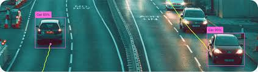

# Object Tracking with Background Subtraction

This project is a Streamlit application that performs object tracking on uploaded videos using background subtraction. The app displays the original video alongside the processed video with detected objects, and provides interactive controls for playback speed and rectangle color customization.



> 🔗 **Live Demo**: [Click here to open the deployed project](https://trackingproject-ohzx8lhx4si79ttxdpk6v8.streamlit.app/)

---

## Features

- **Object Tracking**: Uses background subtraction to detect and track moving objects in video frames.
- **Customizable Settings**: 
  - Choose the rectangle color for detected objects.
  - Control the video playback speed with a slider.
- **Side-by-Side Display**: Shows original and processed video frames next to each other.
- **Realistic Progress & Duration Bar**: Updates a progress bar and displays remaining video duration.
- **Stop Functionality**: Allows stopping the video processing, which clears progress indicators.

---

## Prerequisites

- Python 3.7 or higher
- [Streamlit](https://streamlit.io/)
- [OpenCV](https://opencv.org/)
- [NumPy](https://numpy.org/)

---

## Installation

1. Clone the repository:
   ```bash
   git clone <repository-url>
   cd <repository-directory>
````

2. (Optional) Create and activate a virtual environment:

   ```bash
   python -m venv venv
   venv\Scripts\activate    # On Windows
   source venv/bin/activate # On macOS/Linux
   ```

3. Install the required packages:

   ```bash
   pip install streamlit opencv-python-headless numpy
   ```

---

## Usage

1. Run the Streamlit app:

   ```bash
   streamlit run Tracking_app.py
   ```

2. Open your browser and navigate to the provided local URL.

3. Upload a video file (supported formats: mp4, avi, mov) using the file uploader in the app.

4. Adjust the rectangle color and playback speed as desired.

5. Use the "Stop Video" button to halt processing at any time, which will also remove the progress and remaining time display.

---

## Project Structure

* **Tracking\_app.py**: Main Python file containing the object tracking and Streamlit user interface code.
* **README.md**: Project documentation.
* **screenshot.png**: A screenshot of the application (make sure this file exists and is correctly named).

---

## License

This project is licensed under the MIT License. See the [LICENSE](LICENSE) file for details.

---

## Acknowledgments

* [Streamlit Documentation](https://docs.streamlit.io/)
* [OpenCV Documentation](https://docs.opencv.org/)
